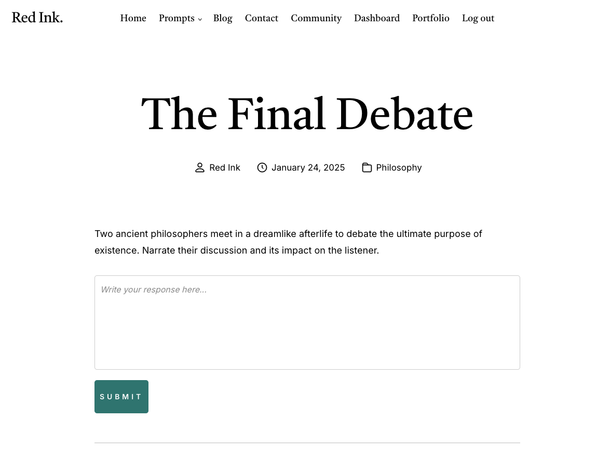

# Creative Writing Platform

Welcome to the RedInk! This is a space for writers to practice, share, and grow their creative writing skills. You are presented with a daily prompt and can choose to write a private entry or publish it on the community board. You can also edit your entries at any time.

## Features

- **Create an Account & Log In**: Sign up and log in to your account to start writing.
- **Daily Writing Prompts**: Receive a new creative writing prompt every day to inspire your writing.
- **Private or Public Entries**: Choose to keep your entries private, or publish them on the community board to share with others.
- **Edit Entries**: You can edit your entries at any time.
- **Community Interaction**: Read and get inspired by other users' submissions on the community board.
- **Contact the Developer**: Have questions, concerns, or prompt suggestions? Contact the developer via the contact page.
- **Join the Newsletter**: Stay up to date with platform updates and new features by subscribing to our newsletter.

## Getting Started

1. **Sign Up**: Create an account to start writing and submitting entries.
2. **Daily Prompt**: Get your creative juices flowing with a new prompt every day.
3. **Write & Publish**: Write your response to the prompt and choose whether to keep it private or share it with the community.
4. **Engage**: Explore the community board to read and get inspired by others' work.
5. **Stay Updated**: Join our newsletter for updates and new features!

## Contact

If you have any questions or suggestions, feel free to reach out to @LycheeLoop using the contact page on the platform.

---

Happy writing!

## Screenshots

Here are some screenshots of the platform in action:

  
-*Home*

  
-*Dashboard featuring daily prompt.*

  
-*Portfolio featuring your completed work.*

  
-*Submit your entries to your portfolio or community board.*
